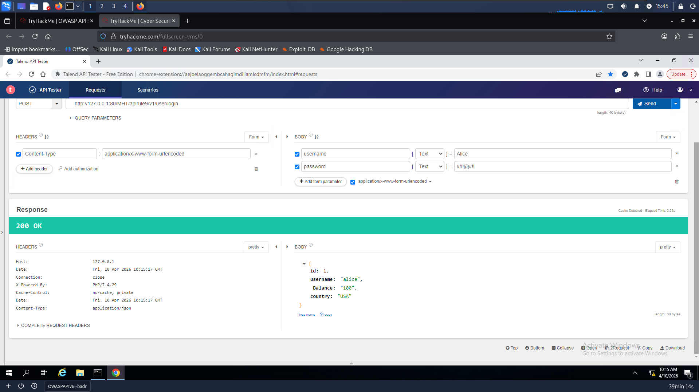
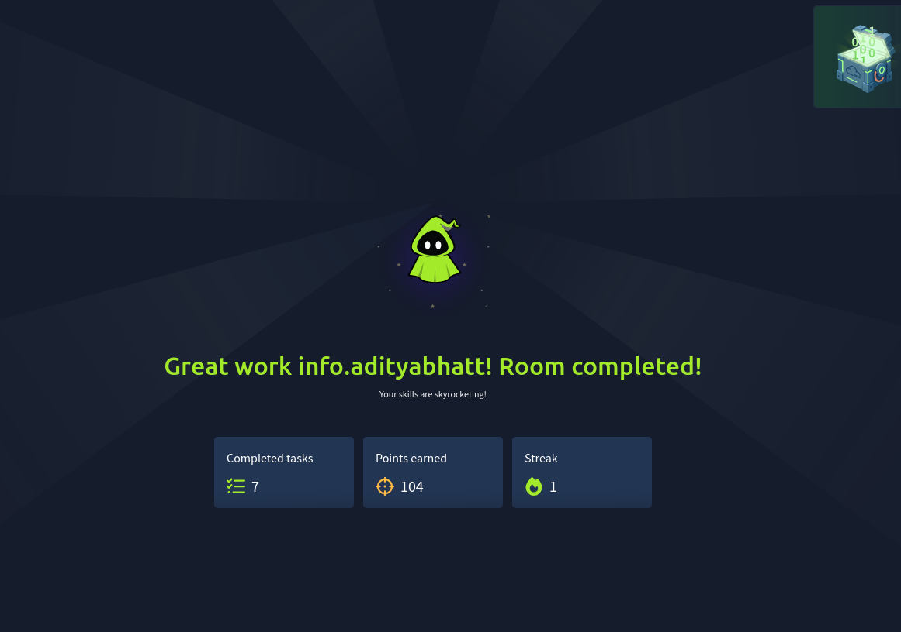

# 🛡️ OWASP API Top 10 — TryHackMe Walkthrough (Part 2)

**Keywords:** OWASP API Top 10, API Security, Mass Assignment, Injection, Security Misconfiguration <br/>
**Description:** Hands-on exploitation and mitigation of advanced API vulnerabilities with real-world scenarios.

---

## 🔗 References & Previous Part

Before diving into Part 2, check out Part 1:

* [Read Part 1 on Medium](https://happycamper84.medium.com/owasp-api-security-top-10-1-tryhackme-walkthrough-252f2a6ecd49?utm_source=chatgpt.com)
* GitHub Repo: [https://github.com/AdityaBhatt3010/OWASP-Top-10-API-THM-Part-1](https://github.com/AdityaBhatt3010/OWASP-Top-10-API-THM-Part-1)

---

# 📌 Introduction

In Part 1, we explored core API vulnerabilities like BOLA, Broken Authentication, and Data Exposure. These primarily revolved around **authorization and authentication flaws**.

Now in Part 2, things get more **backend-heavy and dangerous** — focusing on:

* Improper data handling
* Misconfigurations
* Injection attacks
* Legacy API exposure
* Logging failures

👉 APIs are the backbone of modern applications, and misconfigurations here can lead to **full system compromise** ([TryHackMe][1])


---

# 📌 Task 1 — Environment Setup

We start by launching the TryHackMe machine which includes:

* Windows VM
* Talend API Tester
* Laravel-based vulnerable APIs

This setup allows us to simulate **real-world API exploitation scenarios** instead of just theory.

---

# 📌 Task 2 — Vulnerability VI: Mass Assignment

## 🧠 Understanding the Vulnerability

Mass Assignment occurs when backend frameworks automatically bind user input to database fields.

👉 If not filtered properly, attackers can **inject extra parameters** and manipulate data.

---

## ⚔️ Exploitation

We attempt to create a user but include a hidden field:

```
POST /apirule6/user
```

```
name=attacker&username=hacker&password=pass123&credit=1000
```

➡️ Here, `credit` should NOT be user-controlled.
➡️ But due to mass assignment, backend blindly accepts it.

---

## 💥 Impact

* Privilege escalation
* Data tampering
* Business logic abuse

---

## 🔐 Fix

* Use allowlist (`fillable`)
* Block sensitive fields (`guarded`)
* Never trust client-side input

---

## ✅ Result

Even when we send `credit=1000`, secure endpoint enforces:

➡️ Final credit → **50**

---

# 📌 Task 3 — Vulnerability VII: Security Misconfiguration

## 🧠 Understanding the Vulnerability

Security misconfiguration happens when:

* Debug mode is enabled
* Error messages expose internals
* Default configs are not hardened

---

## ⚔️ Exploitation

Triggering an error:

```
GET /apirule7/ping_v
```

➡️ Instead of a clean response, we get **full stack trace**.

---

## 💥 Impact

* File paths exposed
* Internal architecture revealed
* Helps attackers plan targeted attacks

---

## 🔐 Fix

* Disable debug in production
* Implement proper error handling
* Hide stack traces

---

## ✅ Result

* HTTP Code → **500**
* Error ID → **1401**

---

# 📌 Task 4 — Vulnerability VIII: Injection

## 🧠 Understanding the Vulnerability

Injection occurs when user input is directly executed by backend queries.

👉 Classic example: SQL Injection

---

## ⚔️ Exploitation

We bypass login using:

```
POST /apirule8/user/login_v
```

```
username=admin&password=' OR 1=1--
```

➡️ `' OR 1=1--` makes condition always true
➡️ Authentication bypass achieved 🗿

---

## 💥 Impact

* Authentication bypass
* Data extraction
* Remote Code Execution (in severe cases)

---

## 🔐 Fix

* Parameterized queries
* Input validation
* ORM usage

---

## ✅ Result

Secure endpoint returns:

➡️ **403 Forbidden**

---

# 📌 Task 5 — Vulnerability IX: Improper Assets Management

## 🧠 Understanding the Vulnerability

Old API versions often remain active and become **forgotten attack surfaces**.

---

## ⚔️ Exploitation

We target deprecated API:

```
POST /apirule9/v1/user/login
```

```
username=Alice&password=##!@#!!
```

➡️ Old API leaks extra sensitive data.



---

## 💥 Impact

* Sensitive data leakage
* Access to outdated insecure logic
* Potential full system compromise

---

## 🔐 Fix

* Remove deprecated APIs
* Maintain API inventory
* Use proper versioning

---

## ✅ Result

* Balance → **100**
* Country → **USA**

---

# 📌 Task 6 — Vulnerability X: Insufficient Logging & Monitoring

## 🧠 Understanding the Vulnerability

If logging is weak or missing:

➡️ Attacks happen silently
➡️ No traceability

---

## ⚔️ Exploitation

Trigger logging endpoint:

```
GET /apirule10/logging
```

➡️ Logs metadata like IP, browser, etc.

---

## 💥 Impact

* No forensic evidence
* Delayed detection
* Persistent attacker presence

---

## 🔐 Fix

* Implement SIEM systems
* Log all critical actions
* Monitor anomalies

---

## ✅ Result

➡️ HTTP Response → **200**

---

# 📌 Conclusion

This part highlights a crucial shift:

👉 From **user-level vulnerabilities → backend/system-level failures**



---

## 🧠 Final Insights

Across both parts, a pattern emerges:

* Trusting input → Injection / Mass Assignment
* Poor configs → Info leaks
* Legacy systems → Hidden attack surfaces
* No monitoring → Undetected breaches

---

## 🚀 Final Take

APIs don’t fail because they’re complex —
they fail because **developers trust too much and validate too little.**

---

## 👋 Connect With Me

* GitHub: [https://github.com/AdityaBhatt3010](https://github.com/AdityaBhatt3010)
* LinkedIn: [https://www.linkedin.com/in/adityabhatt3010/](https://www.linkedin.com/in/adityabhatt3010/)
* Medium: [https://medium.com/@adityabhatt3010](https://medium.com/@adityabhatt3010)

---
